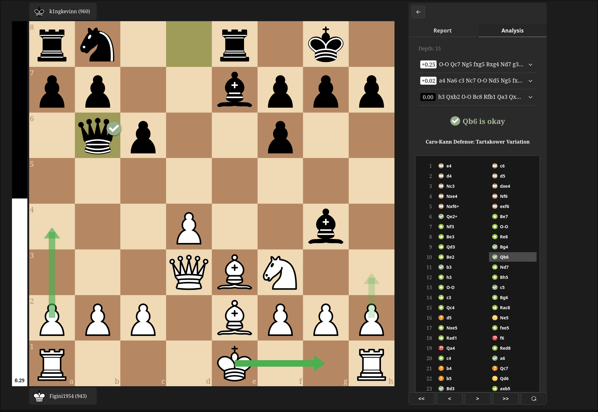

# Chess Analyzer

A full-stack chess analysis app for importing or playing through chess games, reviewing engine evaluations, and classifying moves with Stockfish.

<div align="center">
  
</div>

## Project Structure

```text
.
├── backend/              # FastAPI server and Stockfish engine wrapper
├── frontend/             # React/Vite chess analysis UI
├── docker-compose.yml    # Runs frontend and backend together
└── README.md
```

## Setup With Docker

The easiest way to run the app is with Docker Compose.

```bash
docker compose up --build
```

Then open:

```text
http://localhost:5173
```

The backend runs at:

```text
http://localhost:8000
```

The compose setup builds each service from its own directory:

- `frontend/Dockerfile`
- `backend/Dockerfile`

The backend Docker image installs Stockfish and sets:

```text
STOCKFISH_PATH=/usr/games/stockfish
```

## Local Development

You can also run the frontend and backend directly on your machine.

### Backend

Install Stockfish first. On Debian/Ubuntu:

```bash
sudo apt-get install stockfish
```

Create `backend/.env`:

```text
STOCKFISH_PATH=/path/to/stockfish
```

Use `which stockfish` to find the correct path for your machine.

Create and activate a Python virtual environment:

```bash
cd backend
python -m venv .venv
source .venv/bin/activate
pip install -r requirements.txt
uvicorn server:app --host 0.0.0.0 --port 8000 --reload
```

### Frontend

Create `frontend/.env`:

```text
VITE_API_URL=http://localhost:8000
```

Install dependencies and start Vite:

```bash
cd frontend
npm install
npm run dev
```

Open the URL printed by Vite, usually:

```text
http://localhost:5173
```

## Available Frontend Scripts

Run these from `frontend/`.

```bash
npm run dev      # Start the Vite dev server
npm run build    # Type-check and build the production bundle
npm run lint     # Run ESLint
npm run preview  # Preview the production build locally
```

## Backend API

The backend exposes these endpoints:

- `POST /analyze` - analyze one FEN and return top engine moves
- `POST /batch-analyze` - analyze multiple FENs
- `POST /evaluate` - evaluate one FEN
- `POST /evaluate-moves` - evaluate multiple FENs

Request bodies use FEN strings and optional engine settings such as `depth` and `num_results`.

## Environment Variables

Backend:

```text
STOCKFISH_PATH=/path/to/stockfish
```

Frontend:

```text
VITE_API_URL=http://localhost:8000
```

Do not commit `.env` files. They are intentionally excluded by `.gitignore` and the Docker ignore files.

## Notes

- The backend serializes Stockfish access with an async lock so concurrent API requests do not share the engine unsafely.
- Batch analysis is limited to 50 FENs by the API.
- If Vite starts on a port other than `5173`, the backend CORS settings may need to include that port.
